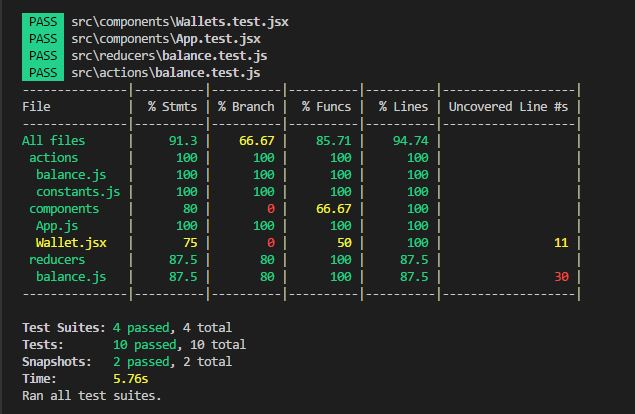

Below you will find some information on how to perform common tasks.<br>
## Table of Contents
- [Available Scripts](#available-scripts)
  - [npm start](#npm-start)
  - [npm test](#npm-test)
  - [npm run build](#npm-run-build)
  - [npm run eject](#npm-run-eject)
- [Running Tests](#running-tests)
  - [Filename Conventions](#filename-conventions)
  - [Command Line Interface](#command-line-interface)
  - [Version Control Integration](#version-control-integration)
  - [Writing Tests](#writing-tests)
  - [Testing Components](#testing-components)
  - [Using Third Party Assertion Libraries](#using-third-party-assertion-libraries)
  - [Initializing Test Environment](#initializing-test-environment)
  - [Focusing and Excluding Tests](#focusing-and-excluding-tests)
  - [Coverage Reporting](#coverage-reporting)
  - [Continuous Integration](#continuous-integration)
  - [Disabling jsdom](#disabling-jsdom)
  - [Snapshot Testing](#snapshot-testing)
  - [Editor Integration](#editor-integration)
- [Troubleshooting](#troubleshooting)
  - [`npm start` doesn’t detect changes](#npm-start-doesnt-detect-changes)
  - [`npm test` hangs on macOS Sierra](#npm-test-hangs-on-macos-sierra)
  - [`npm run build` exits too early](#npm-run-build-exits-too-early)
  - [`npm run build` fails on Heroku](#npm-run-build-fails-on-heroku)
  - [`npm run build` fails to minify](#npm-run-build-fails-to-minify)
  - [Moment.js locales are missing](#momentjs-locales-are-missing)
- [Alternatives to Ejecting](#alternatives-to-ejecting)
- [Something Missing?](#something-missing)
## Available Scripts

In the project directory, you can run:

### `npm start`

Runs the app in the development mode.<br>
Open [http://localhost:3000](http://localhost:3000) to view it in the browser.

The page will reload if you make edits.<br>
You will also see any lint errors in the console.

### `npm test`

Launches the test runner in the interactive watch mode.<br>
See the section about [running tests](#running-tests) for more information.

### `npm run build`

Builds the app for production to the `build` folder.<br>
It correctly bundles React in production mode and optimizes the build for the best performance.

The build is minified and the filenames include the hashes.<br>
Your app is ready to be deployed!

See the section about [deployment](#deployment) for more information.

### `npm run eject`

**Note: this is a one-way operation. Once you `eject`, you can’t go back!**

If you aren’t satisfied with the build tool and configuration choices, you can `eject` at any time. This command will remove the single build dependency from your project.

Instead, it will copy all the configuration files and the transitive dependencies (Webpack, Babel, ESLint, etc) right into your project so you have full control over them. All of the commands except `eject` will still work, but they will point to the copied scripts so you can tweak them. At this point you’re on your own.

You don’t have to ever use `eject`. The curated feature set is suitable for small and middle deployments, and you shouldn’t feel obligated to use this feature. However we understand that this tool wouldn’t be useful if you couldn’t customize it when you are ready for it.
## Running Tests

>Note: this feature is available with `react-scripts@0.3.0` and higher.<br>
>[Read the migration guide to learn how to enable it in older projects!](https://github.com/facebookincubator/create-react-app/blob/master/CHANGELOG.md#migrating-from-023-to-030)

Create React App uses [Jest](https://facebook.github.io/jest/) as its test runner. To prepare for this integration, we did a [major revamp](https://facebook.github.io/jest/blog/2016/09/01/jest-15.html) of Jest so if you heard bad things about it years ago, give it another try.

Jest is a Node-based runner. This means that the tests always run in a Node environment and not in a real browser. This lets us enable fast iteration speed and prevent flakiness.

While Jest provides browser globals such as `window` thanks to [jsdom](https://github.com/tmpvar/jsdom), they are only approximations of the real browser behavior. Jest is intended to be used for unit tests of your logic and your components rather than the DOM quirks.

We recommend that you use a separate tool for browser end-to-end tests if you need them. They are beyond the scope of Create React App.

### Filename Conventions

Jest will look for test files with any of the following popular naming conventions:

* Files with `.js` suffix in `__tests__` folders.
* Files with `.test.js` suffix.
* Files with `.spec.js` suffix.

The `.test.js` / `.spec.js` files (or the `__tests__` folders) can be located at any depth under the `src` top level folder.

We recommend to put the test files (or `__tests__` folders) next to the code they are testing so that relative imports appear shorter. For example, if `App.test.js` and `App.js` are in the same folder, the test just needs to `import App from './App'` instead of a long relative path. Colocation also helps find tests more quickly in larger projects.

### Command Line Interface

When you run `npm test`, Jest will launch in the watch mode. Every time you save a file, it will re-run the tests, just like `npm start` recompiles the code.

The watcher includes an interactive command-line interface with the ability to run all tests, or focus on a search pattern. It is designed this way so that you can keep it open and enjoy fast re-runs. You can learn the commands from the “Watch Usage” note that the watcher prints after every run:


### Writing Tests

To create tests, add `it()` (or `test()`) blocks with the name of the test and its code. You may optionally wrap them in `describe()` blocks for logical grouping but this is neither required nor recommended.

Jest provides a built-in `expect()` global function for making assertions. A basic test could look like this:

```js
import sum from './sum';

it('sums numbers', () => {
  expect(sum(1, 2)).toEqual(3);
  expect(sum(2, 2)).toEqual(4);
});
```

All `expect()` matchers supported by Jest are [extensively documented here](https://facebook.github.io/jest/docs/en/expect.html#content).<br>
You can also use [`jest.fn()` and `expect(fn).toBeCalled()`](https://facebook.github.io/jest/docs/en/expect.html#tohavebeencalled) to create “spies” or mock functions.

### Testing Components

There is a broad spectrum of component testing techniques. They range from a “smoke test” verifying that a component renders without throwing, to shallow rendering and testing some of the output, to full rendering and testing component lifecycle and state changes.

Different projects choose different testing tradeoffs based on how often components change, and how much logic they contain. If you haven’t decided on a testing strategy yet, we recommend that you start with creating simple smoke tests for your components:

```js
import React from 'react';
import ReactDOM from 'react-dom';
import App from './App';

it('renders without crashing', () => {
  const div = document.createElement('div');
  ReactDOM.render(<App />, div);
});
```

This test mounts a component and makes sure that it didn’t throw during rendering. Tests like this provide a lot of value with very little effort so they are great as a starting point, and this is the test you will find in `src/App.test.js`.

When you encounter bugs caused by changing components, you will gain a deeper insight into which parts of them are worth testing in your application. This might be a good time to introduce more specific tests asserting specific expected output or behavior.

If you’d like to test components in isolation from the child components they render, we recommend using [`shallow()` rendering API](http://airbnb.io/enzyme/docs/api/shallow.html) from [Enzyme](http://airbnb.io/enzyme/). To install it, run:

```sh
npm install --save enzyme enzyme-adapter-react-16 react-test-renderer
```

Alternatively you may use `yarn`:

```sh
yarn add enzyme enzyme-adapter-react-16 react-test-renderer
```

As of Enzyme 3, you will need to install Enzyme along with an Adapter corresponding to the version of React you are using. (The examples above use the adapter for React 16.)

The adapter will also need to be configured in your [global setup file](#initializing-test-environment):

#### `src/setupTests.js`
```js
import { configure } from 'enzyme';
import Adapter from 'enzyme-adapter-react-16';

configure({ adapter: new Adapter() });
```

>Note: Keep in mind that if you decide to "eject" before creating `src/setupTests.js`, the resulting `package.json` file won't contain any reference to it. [Read here](#initializing-test-environment) to learn how to add this after ejecting.

Now you can write a smoke test with it:

```js
import React from 'react';
import { shallow } from 'enzyme';
import App from './App';

it('renders without crashing', () => {
  shallow(<App />);
});
```

Unlike the previous smoke test using `ReactDOM.render()`, this test only renders `<App>` and doesn’t go deeper. For example, even if `<App>` itself renders a `<Button>` that throws, this test will pass. Shallow rendering is great for isolated unit tests, but you may still want to create some full rendering tests to ensure the components integrate correctly. Enzyme supports [full rendering with `mount()`](http://airbnb.io/enzyme/docs/api/mount.html), and you can also use it for testing state changes and component lifecycle.

You can read the [Enzyme documentation](http://airbnb.io/enzyme/) for more testing techniques. Enzyme documentation uses Chai and Sinon for assertions but you don’t have to use them because Jest provides built-in `expect()` and `jest.fn()` for spies.

Here is an example from Enzyme documentation that asserts specific output, rewritten to use Jest matchers:

```js
import React from 'react';
import { shallow } from 'enzyme';
import App from './App';

it('renders welcome message', () => {
  const wrapper = shallow(<App />);
  const welcome = <h2>Welcome to React</h2>;
  // expect(wrapper.contains(welcome)).to.equal(true);
  expect(wrapper.contains(welcome)).toEqual(true);
});
```

All Jest matchers are [extensively documented here](http://facebook.github.io/jest/docs/en/expect.html).<br>
Nevertheless you can use a third-party assertion library like [Chai](http://chaijs.com/) if you want to, as described below.

Additionally, you might find [jest-enzyme](https://github.com/blainekasten/enzyme-matchers) helpful to simplify your tests with readable matchers. The above `contains` code can be written more simply with jest-enzyme.

```js
expect(wrapper).toContainReact(welcome)
```

To enable this, install `jest-enzyme`:

```sh
npm install --save jest-enzyme
```

Alternatively you may use `yarn`:

```sh
yarn add jest-enzyme
```

Import it in [`src/setupTests.js`](#initializing-test-environment) to make its matchers available in every test:

```js
import 'jest-enzyme';
```

### Using Third Party Assertion Libraries

We recommend that you use `expect()` for assertions and `jest.fn()` for spies. If you are having issues with them please [file those against Jest](https://github.com/facebook/jest/issues/new), and we’ll fix them. We intend to keep making them better for React, supporting, for example, [pretty-printing React elements as JSX](https://github.com/facebook/jest/pull/1566).

However, if you are used to other libraries, such as [Chai](http://chaijs.com/) and [Sinon](http://sinonjs.org/), or if you have existing code using them that you’d like to port over, you can import them normally like this:

```js
import sinon from 'sinon';
import { expect } from 'chai';
```

and then use them in your tests like you normally do.

### Initializing Test Environment

>Note: this feature is available with `react-scripts@0.4.0` and higher.

If your app uses a browser API that you need to mock in your tests or if you just need a global setup before running your tests, add a `src/setupTests.js` to your project. It will be automatically executed before running your tests.

For example:

#### `src/setupTests.js`
```js
const localStorageMock = {
  getItem: jest.fn(),
  setItem: jest.fn(),
  clear: jest.fn()
};
global.localStorage = localStorageMock
```

>Note: Keep in mind that if you decide to "eject" before creating `src/setupTests.js`, the resulting `package.json` file won't contain any reference to it, so you should manually create the property `setupTestFrameworkScriptFile` in the configuration for Jest, something like the following:

>```js
>"jest": {
>   // ...
>   "setupTestFrameworkScriptFile": "<rootDir>/src/setupTests.js"
>  }
>  ```

### Focusing and Excluding Tests

You can replace `it()` with `xit()` to temporarily exclude a test from being executed.<br>
Similarly, `fit()` lets you focus on a specific test without running any other tests.

### Coverage Reporting

Jest has an integrated coverage reporter that works well with ES6 and requires no configuration.<br>
Run `npm test -- --coverage` (note extra `--` in the middle) to include a coverage report like this:



Note that tests run much slower with coverage so it is recommended to run it separately from your normal workflow.

#### Configuration

The default Jest coverage configuration can be overriden by adding any of the following supported keys to a Jest config in your package.json.

Supported overrides:
 - [`collectCoverageFrom`](https://facebook.github.io/jest/docs/en/configuration.html#collectcoveragefrom-array)
 - [`coverageReporters`](https://facebook.github.io/jest/docs/en/configuration.html#coveragereporters-array-string)
 - [`coverageThreshold`](https://facebook.github.io/jest/docs/en/configuration.html#coveragethreshold-object)
 - [`snapshotSerializers`](https://facebook.github.io/jest/docs/en/configuration.html#snapshotserializers-array-string)

Example package.json:

```json
{
  "name": "your-package",
  "jest": {
    "collectCoverageFrom" : [
      "src/**/*.{js,jsx}",
      "!<rootDir>/node_modules/",
      "!<rootDir>/path/to/dir/"
    ],
    "coverageThreshold": {
      "global": {
        "branches": 90,
        "functions": 90,
        "lines": 90,
        "statements": 90
      }
    },
    "coverageReporters": ["text"],
    "snapshotSerializers": ["my-serializer-module"]
  }
}
```


### Disabling jsdom

By default, the `package.json` of the generated project looks like this:

```js
  "scripts": {
    "start": "react-scripts start",
    "build": "react-scripts build",
    "test": "react-scripts test --env=jsdom"
```

If you know that none of your tests depend on [jsdom](https://github.com/tmpvar/jsdom), you can safely remove `--env=jsdom`, and your tests will run faster:

```diff
  "scripts": {
    "start": "react-scripts start",
    "build": "react-scripts build",
-   "test": "react-scripts test --env=jsdom"
+   "test": "react-scripts test"
```

To help you make up your mind, here is a list of APIs that **need jsdom**:

* Any browser globals like `window` and `document`
* [`ReactDOM.render()`](https://facebook.github.io/react/docs/top-level-api.html#reactdom.render)
* [`TestUtils.renderIntoDocument()`](https://facebook.github.io/react/docs/test-utils.html#renderintodocument) ([a shortcut](https://github.com/facebook/react/blob/34761cf9a252964abfaab6faf74d473ad95d1f21/src/test/ReactTestUtils.js#L83-L91) for the above)
* [`mount()`](http://airbnb.io/enzyme/docs/api/mount.html) in [Enzyme](http://airbnb.io/enzyme/index.html)

In contrast, **jsdom is not needed** for the following APIs:

* [`TestUtils.createRenderer()`](https://facebook.github.io/react/docs/test-utils.html#shallow-rendering) (shallow rendering)
* [`shallow()`](http://airbnb.io/enzyme/docs/api/shallow.html) in [Enzyme](http://airbnb.io/enzyme/index.html)

Finally, jsdom is also not needed for [snapshot testing](http://facebook.github.io/jest/blog/2016/07/27/jest-14.html).

### Snapshot Testing

Snapshot testing is a feature of Jest that automatically generates text snapshots of your components and saves them on the disk so if the UI output changes, you get notified without manually writing any assertions on the component output. [Read more about snapshot testing.](http://facebook.github.io/jest/blog/2016/07/27/jest-14.html)

### Editor Integration

If you use [Visual Studio Code](https://code.visualstudio.com), there is a [Jest extension](https://github.com/orta/vscode-jest) which works with Create React App out of the box. This provides a lot of IDE-like features while using a text editor: showing the status of a test run with potential fail messages inline, starting and stopping the watcher automatically, and offering one-click snapshot updates.


## Debugging Tests

There are various ways to setup a debugger for your Jest tests. We cover debugging in Chrome and [Visual Studio Code](https://code.visualstudio.com/).

>Note: debugging tests requires Node 8 or higher.

### Debugging Tests in Chrome

Add the following to the `scripts` section in your project's `package.json`
```json
"scripts": {
    "test:debug": "react-scripts --inspect-brk test --runInBand --env=jsdom"
  }
```
Place `debugger;` statements in any test and run:
```bash
$ npm run test:debug
```

This will start running your Jest tests, but pause before executing to allow a debugger to attach to the process.

Open the following in Chrome
```
about:inspect
```

After opening that link, the Chrome Developer Tools will be displayed. Select `inspect` on your process and a breakpoint will be set at the first line of the react script (this is done simply to give you time to open the developer tools and to prevent Jest from executing before you have time to do so). Click the button that looks like a "play" button in the upper right hand side of the screen to continue execution. When Jest executes the test that contains the debugger statement, execution will pause and you can examine the current scope and call stack.

>Note: the --runInBand cli option makes sure Jest runs test in the same process rather than spawning processes for individual tests. Normally Jest parallelizes test runs across processes but it is hard to debug many processes at the same time.

### Debugging Tests in Visual Studio Code

Debugging Jest tests is supported out of the box for [Visual Studio Code](https://code.visualstudio.com).

Use the following [`launch.json`](https://code.visualstudio.com/docs/editor/debugging#_launch-configurations) configuration file:
```
{
  "version": "0.2.0",
  "configurations": [
    {
      "name": "Debug CRA Tests",
      "type": "node",
      "request": "launch",
      "runtimeExecutable": "${workspaceRoot}/node_modules/.bin/react-scripts",      
      "args": [
        "test",
        "--runInBand",
        "--no-cache",
        "--env=jsdom"
      ],
      "cwd": "${workspaceRoot}",
      "protocol": "inspector",
      "console": "integratedTerminal",
      "internalConsoleOptions": "neverOpen"
    }
  ]
}
```
## Troubleshooting

### `npm start` doesn’t detect changes

When you save a file while `npm start` is running, the browser should refresh with the updated code.<br>
If this doesn’t happen, try one of the following workarounds:

* If your project is in a Dropbox folder, try moving it out.
* If the watcher doesn’t see a file called `index.js` and you’re referencing it by the folder name, you [need to restart the watcher](https://github.com/facebookincubator/create-react-app/issues/1164) due to a Webpack bug.
* Some editors like Vim and IntelliJ have a “safe write” feature that currently breaks the watcher. You will need to disable it. Follow the instructions in [“Adjusting Your Text Editor”](https://webpack.js.org/guides/development/#adjusting-your-text-editor).
* If your project path contains parentheses, try moving the project to a path without them. This is caused by a [Webpack watcher bug](https://github.com/webpack/watchpack/issues/42).
* On Linux and macOS, you might need to [tweak system settings](https://github.com/webpack/docs/wiki/troubleshooting#not-enough-watchers) to allow more watchers.
* If the project runs inside a virtual machine such as (a Vagrant provisioned) VirtualBox, create an `.env` file in your project directory if it doesn’t exist, and add `CHOKIDAR_USEPOLLING=true` to it. This ensures that the next time you run `npm start`, the watcher uses the polling mode, as necessary inside a VM.

If none of these solutions help please leave a comment [in this thread](https://github.com/facebookincubator/create-react-app/issues/659).

### `npm test` hangs on macOS Sierra

If you run `npm test` and the console gets stuck after printing `react-scripts test --env=jsdom` to the console there might be a problem with your [Watchman](https://facebook.github.io/watchman/) installation as described in [facebookincubator/create-react-app#713](https://github.com/facebookincubator/create-react-app/issues/713).

We recommend deleting `node_modules` in your project and running `npm install` (or `yarn` if you use it) first. If it doesn't help, you can try one of the numerous workarounds mentioned in these issues:

* [facebook/jest#1767](https://github.com/facebook/jest/issues/1767)
* [facebook/watchman#358](https://github.com/facebook/watchman/issues/358)
* [ember-cli/ember-cli#6259](https://github.com/ember-cli/ember-cli/issues/6259)

It is reported that installing Watchman 4.7.0 or newer fixes the issue. If you use [Homebrew](http://brew.sh/), you can run these commands to update it:

```
watchman shutdown-server
brew update
brew reinstall watchman
```

You can find [other installation methods](https://facebook.github.io/watchman/docs/install.html#build-install) on the Watchman documentation page.

If this still doesn’t help, try running `launchctl unload -F ~/Library/LaunchAgents/com.github.facebook.watchman.plist`.

There are also reports that *uninstalling* Watchman fixes the issue. So if nothing else helps, remove it from your system and try again.

### `npm run build` exits too early

It is reported that `npm run build` can fail on machines with limited memory and no swap space, which is common in cloud environments. Even with small projects this command can increase RAM usage in your system by hundreds of megabytes, so if you have less than 1 GB of available memory your build is likely to fail with the following message:

>  The build failed because the process exited too early. This probably means the system ran out of memory or someone called `kill -9` on the process.

If you are completely sure that you didn't terminate the process, consider [adding some swap space](https://www.digitalocean.com/community/tutorials/how-to-add-swap-on-ubuntu-14-04) to the machine you’re building on, or build the project locally.

### `npm run build` fails on Heroku

This may be a problem with case sensitive filenames.
Please refer to [this section](#resolving-heroku-deployment-errors).

### Moment.js locales are missing

If you use a [Moment.js](https://momentjs.com/), you might notice that only the English locale is available by default. This is because the locale files are large, and you probably only need a subset of [all the locales provided by Moment.js](https://momentjs.com/#multiple-locale-support).

To add a specific Moment.js locale to your bundle, you need to import it explicitly.<br>
For example:

```js
import moment from 'moment';
import 'moment/locale/fr';
```

If import multiple locales this way, you can later switch between them by calling `moment.locale()` with the locale name:

```js
import moment from 'moment';
import 'moment/locale/fr';
import 'moment/locale/es';

// ...

moment.locale('fr');
```

This will only work for locales that have been explicitly imported before.

### `npm run build` fails to minify

Some third-party packages don't compile their code to ES5 before publishing to npm. This often causes problems in the ecosystem because neither browsers (except for most modern versions) nor some tools currently support all ES6 features. We recommend to publish code on npm as ES5 at least for a few more years.

<br>
To resolve this:

1. Open an issue on the dependency's issue tracker and ask that the package be published pre-compiled.
  * Note: Create React App can consume both CommonJS and ES modules. For Node.js compatibility, it is recommended that the main entry point is CommonJS. However, they can optionally provide an ES module entry point with the `module` field in `package.json`. Note that **even if a library provides an ES Modules version, it should still precompile other ES6 features to ES5 if it intends to support older browsers**.

2. Fork the package and publish a corrected version yourself. 

3. If the dependency is small enough, copy it to your `src/` folder and treat it as application code.

In the future, we might start automatically compiling incompatible third-party modules, but it is not currently supported. This approach would also slow down the production builds.

## Alternatives to Ejecting

[Ejecting](#npm-run-eject) lets you customize anything, but from that point on you have to maintain the configuration and scripts yourself. This can be daunting if you have many similar projects. In such cases instead of ejecting we recommend to *fork* `react-scripts` and any other packages you need. [This article](https://auth0.com/blog/how-to-configure-create-react-app/) dives into how to do it in depth. You can find more discussion in [this issue](https://github.com/facebookincubator/create-react-app/issues/682).

## Something Missing?

If you have ideas for more “How To” recipes that should be on this page, [let us know](https://github.com/facebookincubator/create-react-app/issues) or [contribute some!](https://github.com/facebookincubator/create-react-app/edit/master/packages/react-scripts/template/README.md)
